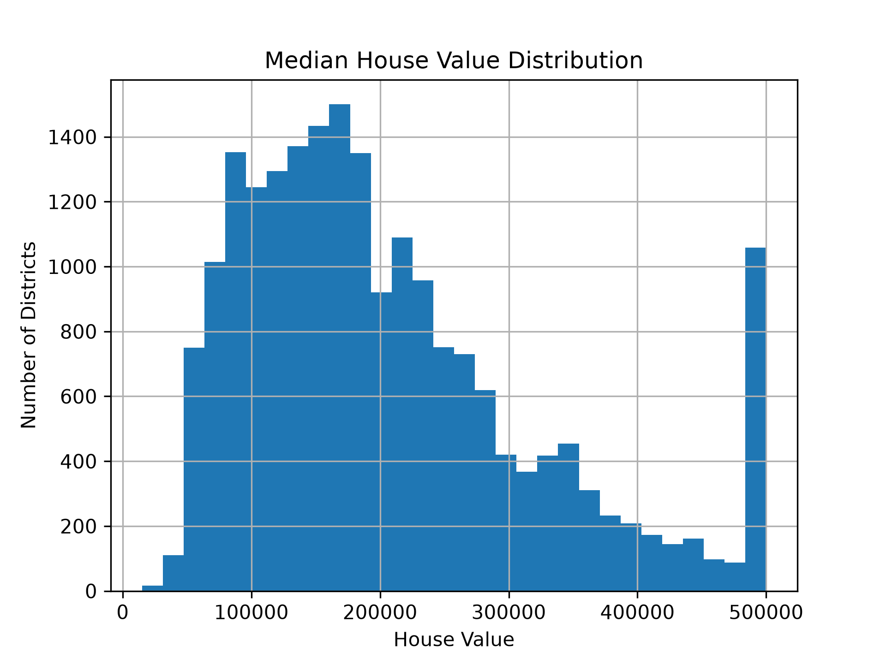

California Housing Price Prediction
## Distribution of House Prices

Overview

This project uses Linear Regression to predict California house prices based on demographic and geographical information.

The project demonstrates a complete beginner-friendly machine learning workflow, including:

Data loading
Exploratory Data Analysis
Missing value handling
Feature engineering
Model training
Performance evaluation
Technologies
Python
Pandas
NumPy
Matplotlib
Scikit-learn
Dataset

California Housing Dataset

20,640 housing districts across California.

## Results
Mean Absolute Error
≈ $50,701.78
This means the model's predictions differ from the actual house prices by approximately $51,000 on average.

## What I Learned
Exploring datasets with Pandas
Understanding features and target variables
Handling missing values with mean imputation
Splitting data into training and testing sets
Training a Linear Regression model
Evaluating performance using Mean Absolute Error (MAE)
Making predictions on unseen data

## Future Improvements
Random Forest Regression
Gradient Boosting
Better Feature Engineering
Hyperparameter Tuning
